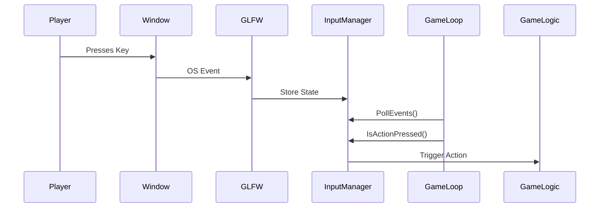
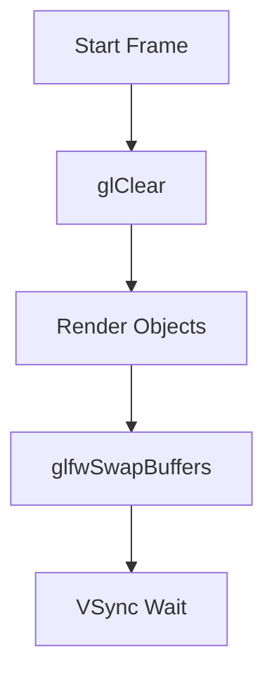
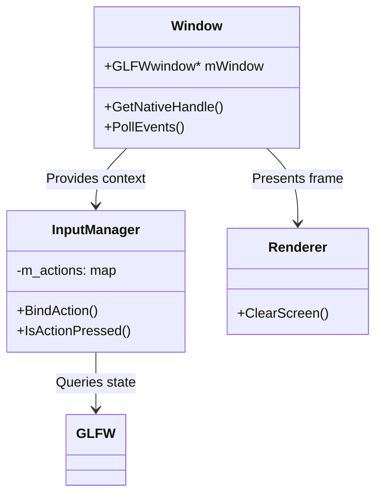

# ✅ Week 1: Renderer and Clear Screen – Hearthvale

> Duration: ~3 hours  
> Goal: Build a clean `Renderer` abstraction and render a blue screen using OpenGL.

---

## 🧠 Part 1: Concepts First – Why a Renderer? (30 min)

### 📚 Learning Topics:
- Abstraction in C++
- Why not call OpenGL directly in main?
- Benefits of encapsulating rendering logic

### ✅ Task:
- [x] Read about component-based architecture (e.g., [Game Programming Patterns](https://gameprogrammingpatterns.com/component.html))
- [x] Reflect and answer:

**Q: What will a `Renderer` class do, and why is it better than putting `glClearColor` in `main.cpp`?**  
_A:_ A `Renderer` class encapsulates graphics logic like `glClearColor`, separating it from game logic in `main.cpp`. This follows the Separation of Concerns principle, keeping code modular, readable, and easier to maintain. It also improves testability, allows future backend changes (e.g., OpenGL → Vulkan) without touching unrelated code, and makes the rendering system reusable across the engine.

---

## ⚙️ Part 2: Warm-up with OpenGL Basics (45 min)

### 📚 Learning Topics:
- GLFW (window/context handling)
- GLAD (OpenGL loader)
- OpenGL functions: `glClearColor`, `glClear`

### ✅ Task:
- [x] Go through [LearnOpenGL: Getting Started](https://learnopengl.com/Getting-started/Hello-Window)
- [ ] Create a minimal GLFW + GLAD setup that opens a window and clears the screen with a color.

**Q: What does `glClearColor` actually do in the GPU pipeline?**  
_A:_ `glClearColor` configures the *default fill value* for the color buffer (your screen's pixel data). When you later call `glClear(GL_COLOR_BUFFER_BIT)`, the GPU:  

1. **Instantly overwrites** the entire color buffer with your preset RGBA value.  
2. **No fragment shader involved** – This is a low-level hardware clear operation (faster than manual pixel drawing).  

**Key Notes:**  
- ⚡ **Performance**: Uses optimized GPU pathways (avoids traditional rendering pipeline).  
- 🎨 **Alpha Behavior**: If blending is enabled, the alpha value affects transparency.  
- 🔄 **Frame Prep**: Essential for preventing visual artifacts between frames.  

**Example Workflow:**  
```cpp
// Set clear color (dark green)
glClearColor(0.2f, 0.3f, 0.3f, 1.0f);  // State-setting function

// Render loop
while (running) {
    glClear(GL_COLOR_BUFFER_BIT);  // Fill screen with the color
    // Draw objects here...
}
```

### Learnings

Your Window class owns a `GLFWwindow*` (created via `glfwCreateWindow`).
GLFW's `GLFWwindow` stores a pointer back to your Window object (via `glfwSetWindowUserPointer`).

This creates a bidirectional link: You control the `GLFWwindow*` (C++ side). GLFW can notify your object via callbacks (C side).

```txt
Your C++ World                          GLFW C World
+-------------------+                   +-------------------+
| Window            |                   | GLFWwindow        |
|-------------------|                   |-------------------|
| GLFWwindow* mWin  | <---- owns ------| (internal data)   |
| handleResize()    |                   |                   |
+-------------------+                   +-------------------+
       ^                                         |
       |                                         |
       +--------- glfwSetWindowUserPointer ------+
                     (stores 'this')
```

Here's your **comprehensive GLFW/OpenGL cheatsheet** with architectural diagrams, distilled from our entire conversation:

---

### **Core Functions Cheatsheet**

| Function | Purpose | When to Call | Performance |
|----------|---------|--------------|-------------|
| **`glfwInit()`** | Initialize GLFW library | **Once at startup** | Heavy |
| **`glfwCreateWindow()`** | Create OS window + context | After `glfwInit()` | Heavy |
| **`glfwMakeContextCurrent()`** | Set OpenGL context | After window creation | Moderate |
| **`glfwPollEvents()`** | Process input/OS events | **Start of frame** | Fast |
| **`glfwGetKey()`** | Check keyboard state | After polling | Instant |
| **`glfwSwapBuffers()`** | Present rendered frame | **End of frame** | VSync-dependent |
| **`glfwSetWindowUserPointer()`** | Attach data to window | After creation | Negligible |
| **`glfwGetWindowUserPointer()`** | Retrieve window data | During callbacks | Negligible |
| **`glViewport()`** | Set rendering area | After resize/init | Negligible |
| **`glClearColor()`** | Set screen clear color | Before `glClear()` | Negligible |
| **`glClear()`** | Clear framebuffer | Start of rendering | Moderate |

---

### **Architecture Diagrams**

#### **1. Input Handling Flow**


#### **2. Rendering Pipeline**


#### **3. Class Relationships**


---

### **Key Lessons Learned**

1. **GLFW Encapsulation**
   - Hide GLFW behind `Window` class
   - Use opaque pointers (`GLFWwindow*`) in headers

2. **Input Best Practices**
   ```cpp
   // Good pattern
   void Update() {
       PollEvents();       // GLFW
       HandleInput();      // Your system
       Render();           // OpenGL
       SwapBuffers();      // GLFW
   }
   ```

3. **Error Prevention**
   - Always check `glfwGetCurrentContext()`
   - Validate action bindings exist before checking

4. **Performance Tips**
   - Call `glfwPollEvents()` **once per frame**
   - Use `glfwSwapInterval(1)` for VSync
   - Batch input checks after polling

---

### **Example Frame Loop**
```cpp
while (!window.ShouldClose()) {
    // 1. Input
    window.PollEvents();
    if (input.IsActionPressed("Quit")) break;
    
    // 2. Update
    game.Update(deltaTime);
    
    // 3. Render
    renderer.ClearScreen();
    game.Render();
    
    // 4. Present
    window.SwapBuffers();
}
```

---

## 🏗️ Part 3: Design the Renderer Interface (30 min)

### ✅ Task:
- [ ] Think and design a basic `Renderer` class.

```cpp
class Renderer {
public:
    static void Init();
    static void Shutdown();
    static void SetClearColor(float r, float g, float b, float a);
    static void Clear();
};
```

**Q: Why might `shutdown()` be useful even if it’s empty right now?**  
_A:_


---

## 💻 Part 4: Implement and Hook It Up (60 min)

### ✅ Tasks:
- [ ] Implement the `Renderer` class in `Renderer.cpp`.
- [ ] In `main.cpp`, use the renderer to clear the screen to Hearthvale blue `#73D2DE`.

**Q: What changes in clarity or modularity did you notice after using the Renderer class?**  
_A:_


---

## ✅ Final Check (15 min)

### ✅ Checklist:
- [ ] Renderer clears screen to `#73D2DE`
- [ ] `main.cpp` looks clean and easy to follow
- [ ] Abstraction makes logical sense

**Q: What would break if you called OpenGL directly in multiple places instead of using Renderer?**  
_A:_


---

### 🎥 Optional Reels Prompt
> "My game world begins with a clear sky-blue canvas."  
Show before/after screen, Renderer code, and first output.

---

Happy building 🚀
